# 🍲 밥;도 (Bap;do)
> AI 기반 돼지국밥 맛집 추천 서비스  
> 2025 부산광역시 공공빅데이터 활용 창업경진대회

---

## 📌 프로젝트 소개
부산의 대표 음식 **돼지국밥**을 주제로,  
공공데이터와 네이버 리뷰/이미지를 분석하여  
**유명 맛집과 유사한 ‘숨은 맛집’을 추천하는 플랫폼**입니다.  

- 리뷰 텍스트 자동 라벨링 (맛, 국물, 반찬, 가격 등 13개 속성)  
- 이미지 임베딩(CLIP) 기반 비주얼 유사도 분석  
- 텍스트·이미지 벡터 융합 후 **Top-N 유사 맛집 추천**  

---

## 🛠 사용 기술 스택
- **Data**: 부산시 공공데이터, 네이버 리뷰/이미지  
- **Collect/Prep**: Python, Selenium, BeautifulSoup, Pandas, Polars  
- **NLP**: LangChain + Gemini API (리뷰 자동 태깅)  
- **Vision**: CLIP (이미지 임베딩/유사도)  
- **Recommend**: Cosine Similarity, FAISS  
- **UX Design (담당)**: Flowchart, Use Case Diagram, Figma  

---

## 🧭 서비스 워크플로우 (사용자 관점)
사용자가 서비스를 어떻게 이용하는지를 보여줍니다.

```mermaid
flowchart LR
    U[사용자] --> S1[맛집 검색/추천 요청]
    S1 --> S2[시스템: 리뷰+이미지 분석 실행]
    S2 --> S3[추천 알고리즘 처리]
    S3 --> S4[추천 리스트 생성]
    S4 --> U2[사용자: 결과 확인]
```

---

## 🔎 추천 파이프라인 (데이터/코드 관점)
데이터가 어떻게 흘러가며 추천 결과가 만들어지는지를 보여줍니다.

```mermaid
flowchart TD
    d1["공공데이터 (국밥집 기본정보)"]
    d2["네이버 리뷰 크롤링"]
    d3["음식 사진 크롤링"]

    p1["리뷰 정제 및 전처리"]
    p2["LLM 태깅 (LangChain/Gemini)"]
    p3["이미지 임베딩 (CLIP)"]
    p4["텍스트+이미지 벡터 융합"]

    r1["유사도 계산 (Cosine/FAISS)"]
    r2["Top-N 맛집 추천"]

    d1 --> p1
    d2 --> p1 --> p2
    d3 --> p3
    p2 --> p4
    p3 --> p4 --> r1 --> r2
```

