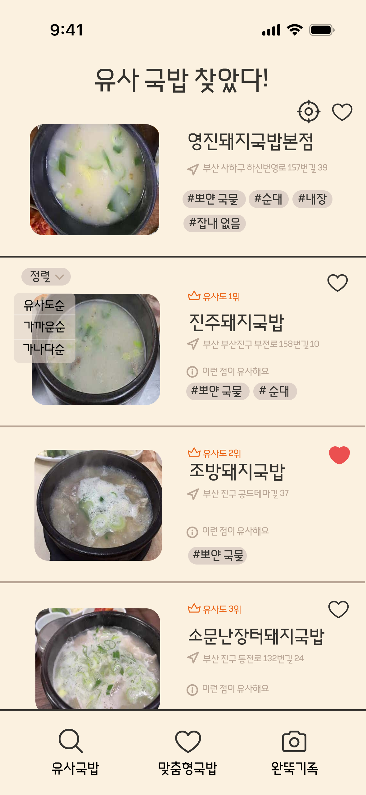
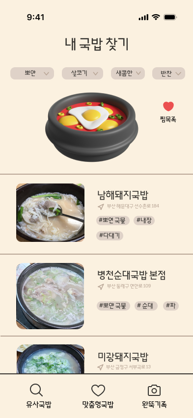
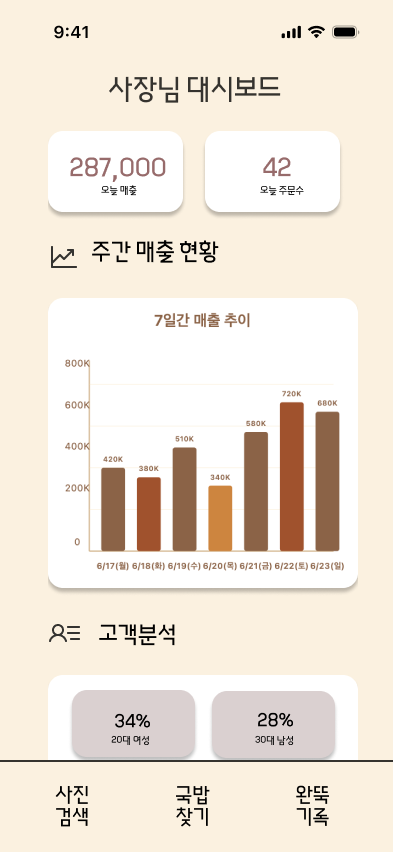

# 🍲 밥;도 (Bap;do)
> AI 기반 돼지국밥 맛집 추천 서비스  
> 2025 부산광역시 공공빅데이터 활용 창업경진대회

---

## 📌 프로젝트 소개
부산의 대표 음식 **돼지국밥**을 주제로,  
공공데이터와 네이버 리뷰/이미지를 분석하여  
**유명 맛집과 유사한 ‘숨은 맛집’을 추천하는 플랫폼**입니다.  

- 리뷰 텍스트 자동 라벨링 (맛, 국물, 반찬, 가격 등 13개 속성)  
- 이미지 임베딩(CLIP) 기반 비주얼 유사도 분석  
- 텍스트·이미지 벡터 융합 후 **Top-N 유사 맛집 추천**  

---

## 🛠 사용 기술 스택
- **Data**: 부산시 공공데이터, 네이버 리뷰/이미지  
- **Collect/Prep**: Python, Selenium, BeautifulSoup, Pandas, Polars  
- **NLP**: LangChain + Gemini API (리뷰 자동 태깅)  
- **Vision**: CLIP (이미지 임베딩/유사도)  
- **Recommend**: Cosine Similarity, FAISS  
- **UX Design (담당)**: Flowchart, Use Case Diagram, Figma  

---

## 🧭 서비스 워크플로우 (사용자 관점)
사용자가 서비스를 어떻게 이용하는지를 보여줍니다.

---

## 🔎 추천 파이프라인 (데이터/코드 관점)
데이터가 어떻게 흘러가며 추천 결과가 만들어지는지를 보여줍니다.

---

## 🎬 데모 & 디자인 산출물

    
  
  

👉 [실제 Figma 시안 보러가기](https://www.figma.com/design/J18MP1ViHTA5qKEUTFFIEt/Untitled?node-id=0-1&p=f&t=TBIj4cpfDHfGXVAY-0)

---

## 👤 담당 역할 (UI/UX Designer & Data Contributor)

- **UI/UX 설계**: 사용자 여정 Flowchart, Figma UI 시안 제작  
- **데이터 파트 보조**: 리뷰 크롤링 및 전처리 파이프라인 일부 기여  
- **발표자료 & 보고서**: 사용자 경험 관점 시각화 및 자료 정리  

---
